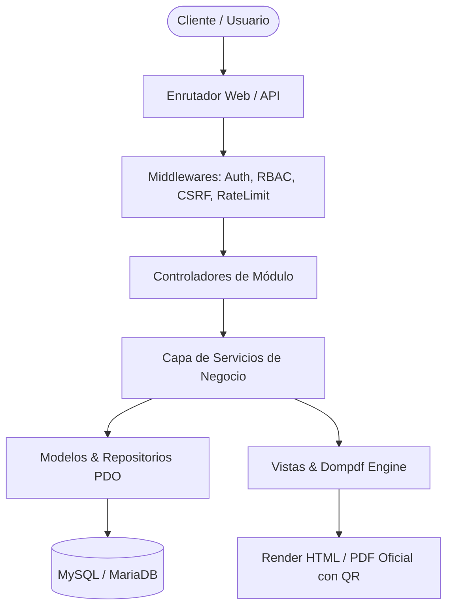
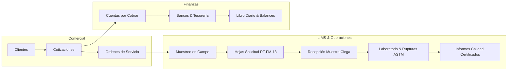
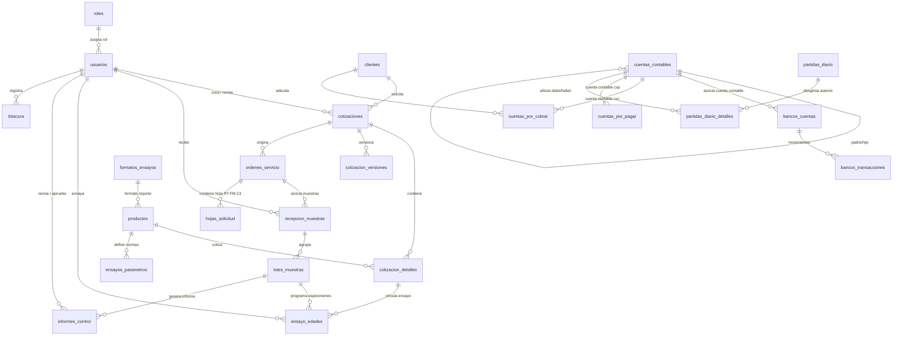

# 🏗️ CYCSA ERP & LIMS v2.0 - Arquitectura, Módulos y Base de Datos

> **Plataforma Corporativa Integral ERP & LIMS para Laboratorios de Ensayo de Concreto, Suelos, Asfaltos, Adoquines y Materiales de Construcción.**  
> Diseñado bajo la norma internacional **ISO/IEC 17025**, arquitectura **Clean Architecture, Domain-Driven Design (DDD) y estándar PSR-4**.

---

## 📋 Tabla de Contenidos
1. [🌟 Descripción General del Sistema](#-descripción-general-del-sistema)
2. [🏛️ Arquitectura de Software y Patrón MVC](#️-arquitectura-de-software-y-patrón-mvc)
3. [📦 Módulos Principales del Negocio (Detalle por Dominio)](#-módulos-principales-del-negocio-detalle-por-dominio)
4. [🗄️ Estructura de la Base de Datos y Diccionario de Entidades](#️-estructura-de-la-base-de-datos-y-diccionario-de-entidades)
5. [🔄 Relaciones y Derivaciones Automáticas del Sistema](#-relaciones-y-derivaciones-automáticas-del-sistema)
6. [🔬 Ciclo Operativo Completo (Flujo de Vida del Negocio)](#-ciclo-operativo-completo-flujo-de-vida-del-negocio)
7. [🔒 Seguridad, Imparcialidad ISO 17025 y Muestra Ciega](#-seguridad-imparcialidad-iso-17025-y-muestra-ciega)
8. [📁 Estructura del Directorio del Proyecto](#-estructura-del-directorio-del-proyecto)
9. [🚀 Guía de Despliegue y Configuración](#-guía-de-despliegue-y-configuración)

---

## 🌟 Descripción General del Sistema

**CYCSA ERP & LIMS v2.0** es la solución tecnológica integral desarrollada para **CYCSA S.A.** para gestionar el ciclo de vida completo de un laboratorio de ensayo de materiales de construcción acreditado o en proceso de acreditación bajo la **Norma Internacional ISO/IEC 17025**.

El sistema integra de forma nativa dos grandes áreas corporativas:
1. **Gestión Comercial y Financiera (ERP):** Catálogo de clientes, cotizaciones con historial de versiones, órdenes de servicio, facturación en Cuentas por Cobrar (CxC), Cuentas por Pagar (CxP), gestión bancaria y contabilidad completa bajo partida doble (Libro Diario, Balance General y Estado de Resultados).
2. **Gestión Técnica de Laboratorio (LIMS):** Recepción y sellado de muestras con codificación ciega (`MS-XXXX-YY` / `CAM-YY-XXXX`), programación de ensayos por edades de diseño (3, 7, 14, 28 días), captura de rupturas mecánicas bajo normas ASTM/AASHTO, detección de regresión de resistencia, formatos normativos (`CYCSA-RT-FM-13`, `CYCSA-RT-FM-07`) y emisión de informes técnicos certificados con firmas digitales y código QR.

---

## 🏛️ Arquitectura de Software y Patrón MVC

La plataforma implementa una arquitectura desacoplada y orientada a servicios:

* **Motor Núcleo (`app/Core/`):**
  * `Aplicacion.php`: Enrutamiento y ciclo de vida de la aplicación.
  * `Conexion.php`: Conexión PDO Singleton con soporte para transacciones ACID y bloqueos concurrentes `GET_LOCK`.
  * `Enrutador.php`: Despacho de rutas web y endpoints de API REST.
  * `ControladorBase.php` & `ModeloBase.php`: Clases base con inyección de dependencias y utilidades de renderizado.
* **Pipeline de Middlewares (`app/Middleware/`):**
  * `AuthMiddleware`: Verificación de sesión activa.
  * `AdminMiddleware` / `SupervisorMiddleware` / `ContabilidadMiddleware`: Autorización por roles y permisos (RBAC).
  * `CsrfMiddleware`, `RateLimitMiddleware` y `SecurityHeadersMiddleware`: Mitigación de ataques CSRF, fuerza bruta e inyección de encabezados.
* **Capa de Servicios y Repositorios (`app/Services/`, `app/Repositories/`):** Aislamiento de la lógica de negocio (`CotizacionService`, `LimsService`, `ClienteService`, `LogService`).
* **Autocarga PSR-4:** Configuración modular en `composer.json` mapeando namespaces `Cycsa\...`.



---

## 📦 Módulos Principales del Negocio (Detalle por Dominio)



### 1. 🔐 Autenticación (`app/Modulos/Autenticacion`)
* Inicio de sesión seguro con hashing Bcrypt (`password_hash()`).
* **Sesión Única Activa:** Comprobación de `session_id` para evitar sesiones simultáneas no autorizadas en distintos dispositivos.
* Protección contra fuerza bruta con bloqueo por intentos fallidos.
* Recuperación de contraseñas mediante tokens temporales y política de cambio obligatorio de clave.

### 2. 👥 Usuarios, Roles y Auditoría (`app/Modulos/Usuarios`)
* Control de acceso basado en roles (**RBAC**): *Administrador, Supervisor, Técnico de Laboratorio, Contador, Cliente*.
* Permisos granulares configurables por módulo en formato JSON.
* **Bitácora de Auditoría Global (`bitacora`):** Registro inmutable de cada acción crítica (usuario, IP, módulo, acción, fecha y hora).

### 3. 🏢 Clientes (`app/Modulos/Clientes`)
* Catálogo unificado de clientes *Naturales* y *Jurídicos* con validación de RUC / Cédula.
* Condiciones comerciales: límites de crédito, días de crédito, prórrogas y cuentas contables asociadas.
* Gestión de proyectos de construcción y contactos clave.

### 4. 🔬 Catálogo de Productos y Ensayos (`app/Modulos/Productos`)
* Catálogo de ensayos normalizados (*ASTM C39, AASHTO T22, ASTM C140, ASTM D422, ASTM D1557*, etc.).
* Clasificación por matrices: *Concreto, Suelos, Adoquines, Agregados, Morteros, Asfaltos*.
* Parámetros de resistencia mínima esperada a diferentes edades de curado (`ensayos_parametros`).
* Vinculación a esquemas y plantillas de formatos analíticos (`formatos_ensayos`).

### 5. 📄 Cotizaciones Comerciales (`app/Modulos/Cotizaciones`)
* Generador de cotizaciones con numeración correlativa `COT-YYYY-XXXX`.
* Cálculo de subtotales, descuentos, IVA (15%) o registro de exoneración fiscal.
* **Flujo de Aprobación:** `Borrador` $\rightarrow$ `En Revisión` $\rightarrow$ `Observada` $\rightarrow$ `Aprobada Internamente` $\rightarrow$ `Enviada al Cliente` $\rightarrow$ `Aprobada/Rechazada`.
* Historial completo de versiones (`cotizacion_versiones`).
* **Portal del Cliente con Token Seguro:** Permite al cliente revisar el PDF oficial y aceptar/rechazar en línea seleccionando el método de pago (Contado, Crédito, Anticipo).

### 6. 📋 Órdenes de Servicio (`app/Modulos/OrdenesServicio`)
* Generación de la orden de trabajo `OS-YYYY-XXXX` al aprobarse una cotización.
* Manejo de contratos puntuales y mensuales.
* **Logística de Muestreo:** Asignación de fecha, hora, técnico responsable (`tecnicos`) y vehículo de la empresa (`vehiculos`).

### 7. 📑 Hojas de Solicitud de Servicio (`app/Modulos/HojasServicio`)
* Formato técnico oficial **`CYCSA-RT-FM-13`**.
* Registro de procedencia de muestra, persona que entrega, persona que recibe y ensayos solicitados.
* **Protección de Datos:** Edición restringida exclusivamente a *Estado 1: Recepción* y *Estado 2: Observada*.

### 8. 🧪 Operaciones LIMS y Laboratorio (`app/Modulos/Operaciones`)
* **Muestra Ciega y Sellado Inmutable:** Generación de códigos `MS-XXXX-YY` (Laboratorio) o `CAM-YY-XXXX` (Campo). El laboratorista trabaja sin conocer la identidad del cliente ni los precios.
* **Especímenes y Programación:** Cálculo automático del calendario de rupturas (3, 7, 14, 28 días) a partir de la fecha de moldeo.
* **Captura de Rupturas Mecánicas:** Cálculo en tiempo real de:
  $$\text{Resistencia (PSI)} = \frac{\text{Carga (lbs)}}{\text{Área (in}^2\text{)}}$$
  $$\text{Resistencia (Kg/cm}^2\text{)} = \text{PSI} \times 0.070307$$
  $$\% \text{ de Diseño Alcanzado} = \frac{\text{Resistencia (PSI)}}{\text{Diseño (PSI)}} \times 100$$
* **Alerta de Regresión de Resistencia:** Dispara una no conformidad automática si la resistencia a mayor edad resulta menor que a una edad inferior.
* **Informes de Control de Calidad:** Generación de informes técnicos certificados (`informes_control`), versionados (`V0, V1...`), con firmas digitales y código QR de validación.

### 9. 💼 Contabilidad y Bancos (`app/Modulos/Contabilidad`)
* **Catálogo Contable:** Plan de cuentas jerárquico (Activo, Pasivo, Capital, Ingreso, Egreso) con cuentas de Mayor y Detalle.
* **Cuentas por Cobrar (CxC):** Registro automático de facturas al aprobarse cotizaciones (`FAC-COT-YYYY-XXXX`), control de pagos parciales y saldos.
* **Cuentas por Pagar (CxP):** Gestión de obligaciones y compras a proveedores.
* **Bancos y Tesorería:** Cuentas bancarias en moneda nacional y extranjera, registro de depósitos, transferencias, cheques y retiros con saldos en tiempo real.
* **Libro Diario y Estados Financieros:** Asientos de partida doble automáticos (`PD-XXXXX`) y generación en vivo de Balance General y Estado de Resultados.

### 10. ⚙️ Configuración del Negocio (`app/Modulos/Configuracion`)
* Parámetros comerciales por defecto (términos de pago, vigencias, condiciones).
* Catálogo de técnicos y vehículos de campo.

---

## 🗄️ Estructura de la Base de Datos y Diccionario de Entidades



### Tabla Resumen del Diccionario de Datos:

| Entidad | Clave Primaria | Relaciones Principales | Descripción y Propósito |
| :--- | :--- | :--- | :--- |
| `usuarios` | `id` | `id_rol` $\rightarrow$ `roles(id)` | Usuarios del sistema, credenciales y permisos. |
| `roles` | `id` | - | Perfiles de acceso al sistema (Admin, Técnico, etc.). |
| `clientes` | `id` | - | Catálogo de clientes, información fiscal y créditos. |
| `cotizaciones` | `id` | `id_cliente`, `id_usuario_creador` | Ofertas comerciales (`COT-YYYY-XXXX`). |
| `cotizacion_detalles`| `id` | `id_cotizacion`, `id_producto` | Ensayos y servicios incluidos en la cotización. |
| `cotizacion_versiones`| `id`| `id_cotizacion` | Historial de versiones y renegociaciones. |
| `ordenes_servicio` | `id` | `id_cotizacion` | Órdenes de trabajo (`OS-YYYY-XXXX`). |
| `hojas_solicitud` | `id` | `id_os` | Hoja técnica de recepción `CYCSA-RT-FM-13`. |
| `recepcion_muestras` | `id`| `id_os`, `recibido_por` | Registro y sellado de muestras ciegas (`MS-XXXX-YY`). |
| `lotes_muestras` | `id` | `id_recepcion` | Agrupación de especímenes con datos de moldeo. |
| `ensayo_edades` | `id` | `id_lote`, `id_detalle_cotizacion` | Probetas individuales, cargas, áreas y PSI. |
| `ensayos_parametros` | `id`| `id_producto` | % de resistencia mínima esperada por edad. |
| `informes_control` | `id` | `id_lote`, `revisado_por`, `aprobado_por` | Informes de control de calidad certificados. |
| `cuentas_contables` | `id` | `id_padre` $\rightarrow$ `cuentas_contables` | Plan de cuentas contables jerárquico. |
| `cuentas_por_cobrar` | `id`| `id_cliente`, `id_cuenta_contable` | Facturas por cobrar y control de saldos. |
| `cuentas_por_pagar` | `id` | `id_cuenta_contable` | Cuentas por pagar a proveedores. |
| `bancos_cuentas` | `id` | `id_cuenta_contable` | Cuentas bancarias de la empresa. |
| `bancos_transacciones`| `id`| `id_banco_cuenta` | Movimientos de tesorería y bancos. |
| `partidas_diario` | `id` | - | Asientos contables de partida doble (`PD-XXXXX`). |
| `partidas_diario_detalles`| `id`| `id_partida`, `id_cuenta_contable`| Desglose de Debe y Haber por cuenta. |
| `bitacora` | `id` | `id_usuario` | Registro de auditoría y trazabilidad. |

---

## 🔄 Relaciones y Derivaciones Automáticas del Sistema

El sistema automatiza la propagación de datos entre módulos:

1. **Aprobación de Cotización $\rightarrow$ Creación de OS y CxC:**  
   Al registrarse la aprobación del cliente (`Aprobada por Cliente`):
   * Se crea automáticamente la Orden de Servicio (`OS-YYYY-XXXX`) en estado *Recepción*.
   * Se registra la Factura en `cuentas_por_cobrar` (`FAC-COT-YYYY-XXXX`).
   * Si hubo pago de contado/anticipo, se registra el movimiento en `bancos_transacciones`, se incrementa el saldo bancario y se asienta la Partida de Diario.
2. **Recepción $\rightarrow$ Programación Automática de Rupturas:**  
   Al ingresar una muestra con fecha de moldeo $F_m$ y edades $[3, 7, 28]$ días:
   * Se generan registros en `ensayo_edades` con fecha programada $F_m + N\text{ días}$.
   * Se calculan los correlativos ciegos inmutables en `secuencias_muestras`.
3. **Captura de Ruptura $\rightarrow$ Evaluación Normativa y Alertas:**  
   Al ingresar carga y área:
   * Se calculan $\text{PSI}$, $\text{Kg/cm}^2$ y $\% \text{ de diseño}$.
   * Se compara contra `ensayos_parametros`. Si $\text{PSI}_{28d} < \text{PSI}_{7d}$, se dispara alerta de regresión y se registra en `bitacora`.
4. **Cobros y Pagos $\rightarrow$ Contabilidad de Partida Doble:**  
   Todo abono a CxC o pago de CxP genera automáticamente un asiento cuadrado en `partidas_diario` afectando las cuentas contables de Bancos y Clientes/Proveedores.

---

## 🔬 Ciclo Operativo Completo (Flujo de Vida del Negocio)

```
1. SOLICITUD & COTIZACIÓN
   Cliente solicita ensayos -> Asesor crea COT-YYYY-XXXX -> Supervisor aprueba internamente -> 
   Cliente recibe enlace seguro y aprueba con su condición de pago (Contado/Crédito).

2. DISPARO AUTOMÁTICO DE ORDEN Y FINANZAS
   - Se genera la Orden de Servicio (OS-YYYY-XXXX).
   - Se crea la Factura en Cuentas por Cobrar (FAC-COT-YYYY-XXXX).
   - Si hubo pago inmediato, se ingresa la transacción bancaria y se asienta la Partida de Diario.

3. LOGÍSTICA DE MUESTREO Y RECEPCIÓN
   - Se programa técnico y vehículo si requiere muestreo en campo.
   - En ventanilla/laboratorio se llena la Hoja de Solicitud CYCSA-RT-FM-13.
   - Se genera el código de MUESTRA CIEGA (MS-XXXX-YY) sellando la identidad del cliente.

4. LABORATORIO & RUPTURA (LIMS)
   - El laboratorista consulta el calendario de ensayes en vista ciega.
   - Aplica carga mecánica a los cilindros según la edad (3d, 7d, 14d, 28d).
   - El sistema calcula PSI, Kg/cm² y evalúa contra la norma ASTM.
   - Si existe anomalía o regresión de resistencia, se dispara alerta de calidad.

5. CONTROL DE CALIDAD Y EMISIÓN
   - Se genera el Informe de Control de Calidad oficial en PDF.
   - El supervisor revisa y aprueba digitalmente.
   - El informe queda certificado y listo para entrega con código QR de verificación.

6. CIERRE CONTABLE
   - El cliente abona su saldo en banco -> Se actualiza CxC -> Se registra asiento contable ->
   - Los saldos se reflejan automáticamente en el Balance General y Estado de Resultados.
```

---

## 🔒 Seguridad, Imparcialidad ISO 17025 y Muestra Ciega

* **Aislamiento Técnico LIMS:** El personal técnico de laboratorio únicamente visualiza el código ciego de la muestra y sus características físicas, sin acceso a nombres de clientes ni precios cotizados.
* **Inmutabilidad de Registros:** Una vez ingresada una muestra y sellada (`is_sealed = 1`), los datos de origen no pueden ser alterados por el técnico.
* **Control Concurrente:** Candados `GET_LOCK` a nivel de base de datos para garantizar correlativos secuenciales sin colisiones en entornos de alta concurrencia.
* **Seguridad Web:** Protección CSRF en todas las rutas POST, sanitización de entradas contra inyecciones SQL (Prepared Statements en el 100% de consultas) y encabezados HTTP seguros (`X-Frame-Options`, `X-XSS-Protection`, `X-Content-Type-Options`).

---

## 📁 Estructura del Directorio del Proyecto

```
Cycsa/
├── app/
│   ├── Controllers/          <-- Controladores API y generales
│   ├── Core/                 <-- Motor MVC base (Aplicacion, Conexion, Enrutador, etc.)
│   ├── Exceptions/           <-- AppException y control global de errores
│   ├── Helpers/              <-- Helpers especializados (PDF, fechas, moneda, auth)
│   ├── Middleware/           <-- Middlewares de seguridad y roles
│   ├── Modulos/              <-- Módulos del negocio (10 dominios)
│   │   ├── Autenticacion/
│   │   ├── Clientes/
│   │   ├── Configuracion/
│   │   ├── Contabilidad/
│   │   ├── Cotizaciones/
│   │   ├── HojasServicio/
│   │   ├── Operaciones/
│   │   ├── OrdenesServicio/
│   │   ├── Productos/
│   │   └── Usuarios/
│   ├── Repositories/         <-- Capa de acceso a datos PDO
│   ├── Services/             <-- Capa de servicios de negocio
│   └── Views/                <-- Plantillas de vistas maestras
├── config/                   <-- Configuración global (database, app, mail, constants)
├── database/
│   ├── backups/              <-- Respaldos SQL completos
│   ├── catalogos/            <-- Catálogos de listas de precios y servicios
│   ├── ensayos/              <-- Plantillas Markdown y esquemas de ensayos
│   └── migrations/           <-- Scripts de migración SQL e índices
├── prisma/
│   └── schema.prisma         <-- Definición formal de modelos y relaciones
├── publico/                  <-- DocumentRoot web (index.php, CSS, JS, imágenes)
├── rutas/                    <-- web.php y api.php
├── storage/                  <-- Logs del sistema, PDFs generados y uploads
└── vendor/                   <-- Librerías de Composer (Dompdf, PHPMailer, etc.)
```

---

## 🚀 Guía de Despliegue y Configuración

### 1. Requisitos del Servidor
* **PHP:** 8.1 o superior con extensiones `pdo_mysql`, `mbstring`, `openssl`, `gd`, `curl`, `json`.
* **Base de Datos:** MySQL 5.7+ o MariaDB 10.4+.
* **Servidor Web:** Apache con módulo `mod_rewrite` habilitado (o Nginx).

### 2. Pasos de Instalación
1. Clonar el repositorio:
   ```bash
   git clone https://github.com/Tomate25/CycsaV1.git
   ```
2. Importar el esquema y catálogo inicial de base de datos desde `database/cycsa_db_backup.sql`.
3. Configurar el archivo `.env` en la raíz del proyecto:
   ```env
   APP_URL=http://localhost/Cycsa
   DB_HOST=localhost
   DB_NAME=cycsa_db
   DB_USER=root
   DB_PASS=
   ```
4. Asignar permisos de escritura en directorios de almacenamiento:
   ```bash
   chmod -R 775 storage/
   ```
5. Acceder a la plataforma desde el navegador web en `http://localhost/Cycsa/publico`.

---

## 📜 Créditos y Licencia

Desarrollado para **CYCSA S.A. - Laboratorio de Control de Calidad de Materiales de Construcción**.  
*Plataforma refactorizada bajo arquitectura Enterprise 10/10.*
