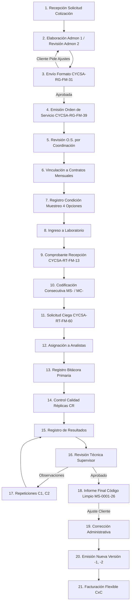

# 🏗️ CYCSA ERP & LIMS - Sistema de Gestión de Laboratorio y Control de Calidad

> **Sistema Integral ERP & LIMS para Laboratorios de Ensayo de Concreto, Suelos, Adoquines y Materiales de Construcción (Norma ISO/IEC 17025).**  
> Desarrollado para **CYCSA S.A.** con arquitectura limpia PHP MVC, diseño web responsivo de múltiples breakpoints y compatibilidad nativa para alojamiento en **Hosting Compartido (Bluehost Sin VPS)**.

---

## 📋 Tabla de Contenidos
1. [Descripción General](#-descripción-general)
2. [Arquitectura y Tecnologías](#-arquitectura-y-tecnologías)
3. [Flujo de Trabajo Operativo Completo (21 Pasos)](#-flujo-de-trabajo-operativo-completo-21-pasos)
4. [Módulos del Sistema](#-módulos-del-sistema)
5. [Seguridad y Control de Accesos](#-seguridad-y-control-de-accesos)
6. [Estructura de la Base de Datos](#-estructura-de-la-base-de-datos)
7. [Guía de Despliegue en Hosting Compartido (Bluehost Sin VPS)](#-guía-de-despliegue-en-hosting-compartido-bluehost-sin-vps)
8. [Créditos y Mantenimiento](#-créditos-y-mantenimiento)

---

## 🌟 Descripción General

**CYCSA ERP & LIMS** es una plataforma web corporativa diseñada para automatizar la gestión técnica, operativa y financiera del laboratorio de control de calidad de materiales. Garantiza la trazabilidad, imparcialidad y rigor técnico exigido por la norma **ISO/IEC 17025**, cubriendo desde la cotización comercial y recepción de especímenes hasta la entrega del informe final al cliente y la facturación.

---

## 🛠️ Arquitectura y Tecnologías

* **Backend:** PHP 8.1+ (Patrón Arquitectónico MVC propio, Liviano, Sin frameworks pesados).
* **Base de Datos:** MySQL / MariaDB (Acceso seguro mediante PDO y consultas preparadas).
* **Librerías PDF:** Dompdf (Generación en servidor de certificados y comprobantes normativos).
* **Frontend:** HTML5, Javascript Vainilla, Sistema de Estilos CSS propio con variables y diseño responsivo multipunto (Móviles, Tablets, Laptops y Escritorio).
* **Iconografía y Gráficos:** FontAwesome 6, ApexCharts (Analíticas de rendimiento y KPIs).
* **Servidor Web:** Apache / LiteSpeed (Configurado mediante reglas de reescritura `.htaccess` para servidores compartidos como Bluehost).

---

## 🔄 Flujo de Trabajo Operativo Completo (21 Pasos)

El sistema implementa y valida al 100% la trayectoria de trabajo requerida por la norma y la operación de CYCSA:



---

## 📦 Módulos del Sistema

### 1. 🎯 Cajón de Aplicaciones (`/panel`)
* Matriz de botones responsivos centrados automáticamente.
* Muestra de forma inteligente únicamente los módulos a los que el usuario tiene acceso según sus permisos.

### 2. 📄 Cotizaciones Comerciales (`/cotizaciones`)
* Emisión del formato oficial **CYCSA-RG-FM-31**.
* Flujo de estados: `Borrador` $\rightarrow$ `En Revisión` $\rightarrow$ `Aprobada Internamente` $\rightarrow$ `Enviada al Cliente`.
* Control automático de versiones (`version = version + 1`) tras modificaciones solicitadas por el cliente.

### 3. 🧪 Operaciones LIMS (`/operaciones`)
* **Orden de Servicio CYCSA-RG-FM-39:** Generación y control de revisiones.
* **Condiciones del Muestreo (Paso 7):** Registro normativo de las 4 opciones de muestreo y obtención de datos.
* **Comprobante de Recepción CYCSA-RT-FM-13:** Generación e impresión de PDF.
* **Codificación Anual:** Generación de correlativos `MS-%04d-%02d` (Laboratorio Central) y `MC-%04d-%02d` (Campo).
* **Solicitud Ciega CYCSA-RT-FM-60:** Pantalla ciega para laboratoristas sin datos del cliente (ISO 17025).
* **Réplicas (`CR`) y Repeticiones (`C1`, `C2`):** Asignación de sufijos de calidad e independización de lecturas.
* **Emisión de Informes Limpios (Paso 18):** Despojo automático de sufijos internos (`CR`, `C1`) para la entrega al cliente (`obtenerCodigoLimpioInforme`).
* **Versiones del Informe:** Emisión incremental de versiones (`-1`, `-2`).

### 4. 👥 Clientes (`/clientes`)
* Registro y gestión de personas naturales o jurídicas, RUC, contactos y proyectos asociados.

### 5. 🔬 Catálogo de Ensayos (`/productos`)
* Configuración de tarifarios, parámetros técnicos y normativas aplicables (ASTM C39, AASHTO T22, etc.).

### 6. 💼 Contabilidad & Finanzas (`/contabilidad`)
* Cuentas por Cobrar (CxC), Cuentas por Pagar (CxP), Control de Bancos y Libro Diario de asientos contables.

### 7. 👥 Usuarios & Permisos (`/usuarios`)
* Gestión centralizada de accesos con asignación de roles.

### 8. 🛡️ Bitácora de Auditoría (`/panel/bitacora`)
* Historial de movimientos en tiempo real. Traduce dinámicamente cualquier referencia técnica de la base de datos a códigos amigables (`OS-2026-001`) y nombre de cliente.

---

## 🔒 Seguridad y Control de Accesos

1. **Protección de Sesión Única:** Al iniciar sesión, se invalida cualquier sesión previa del usuario mediante el campo `session_id`.
2. **Bloqueo por Intentos Fallidos:** Tras 5 intentos fallidos consecutivos con contraseña errónea, la cuenta se bloquea automáticamente (`bloqueado = 1`).
3. **Desbloqueo Centralizado por el Administrador:**
   * El desbloqueo es ejecutado únicamente por el Supervisor/Administrador.
   * El sistema genera una **contraseña temporal aleatoria** (ej: `CYC-8F92A1`) encriptada en BD mediante `password_hash()` con la bandera `debe_cambiar_password = 1`.
   * El Administrador recibe una ventana modal con la contraseña en texto plano y botón de copiado directo para enviársela al usuario.
4. **Cambio Obligatorio de Contraseña:** Al ingresar con la contraseña temporal, el sistema intercepta el acceso y obliga al usuario a establecer una nueva clave personal encriptada antes de permitir el ingreso al panel.
5. **Remoción de Autorreseteo Libre:** Se eliminó el enlace público de recuperación de contraseña para mantener el control de seguridad centralizado en la administración.

---

## 📊 Estructura de la Base de Datos

| Tabla | Descripción |
|---|---|
| `usuarios` | Cuentas de acceso, contraseñas hasheadas, intentos fallidos y bloqueos |
| `roles` | Roles del sistema y matriz de permisos JSON |
| `cotizaciones` | Propuestas comerciales, versiones y totales |
| `cotizacion_detalles` | Ítems y parámetros cotizados |
| `ordenes_servicio` | Órdenes de trabajo técnicas (CYCSA-RG-FM-39) |
| `hojas_solicitud` | Comprobantes de ingreso de muestra (CYCSA-RT-FM-13) y condición de muestreo |
| `recepcion_muestras` | Control de lotes y especímenes codificados (MS- / MC-) |
| `informes_control` | Informes emitidos y control de versiones (-1, -2) |
| `cuentas_por_cobrar` | Control financiero CxC |
| `cuentas_por_pagar` | Control financiero CxP |
| `cuentas_contables` | Catálogo maestro de cuentas contables |
| `bancos_cuentas` | Cuentas bancarias de la empresa |
| `bitacora` | Registro global de auditoría e IP |

---

## 🚀 Guía de Despliegue en Hosting Compartido (Bluehost Sin VPS)

Este proyecto está optimizado para funcionar en servidores de **hosting compartido tradicionales** (Apache o LiteSpeed en cPanel/Bluehost) sin necesidad de un servidor privado virtual (VPS) ni procesos Node.js de fondo.

### Paso 1: Carga de Archivos
Subir todos los archivos del proyecto al directorio principal del hosting (normalmente `public_html/` o `public_html/Cycsa/`).

### Paso 2: Configuración de Reescritura Apache (`.htaccess`)
Asegúrate de que el archivo `.htaccess` en la raíz apunte correctamente a la carpeta pública:

```apache
<IfModule mod_rewrite.c>
    RewriteEngine On
    RewriteRule ^$ publico/ [L]
    RewriteRule (.*) publico/$1 [L]
</IfModule>
```

Y que el archivo `.htaccess` dentro de `/publico/` administre las rutas amigables:

```apache
<IfModule mod_rewrite.c>
    RewriteEngine On
    RewriteCond %{REQUEST_FILENAME} !-f
    RewriteCond %{REQUEST_FILENAME} !-d
    RewriteRule ^ index.php [QSA,L]
</IfModule>
```

### Paso 3: Configuración de Base de Datos (`.env` o `configuracion/database.php`)
Configura las credenciales MySQL proporcionadas por tu cPanel en el archivo `.env`:

```env
DB_HOST=localhost
DB_NAME=nombre_base_datos
DB_USER=usuario_cpanel
DB_PASS=contrasena_segura
```

### Paso 4: Permisos de Directorios
Establece permisos `0755` para carpetas y `0644` para archivos. Asegura permisos de escritura (`0777` o `0755`) en las siguientes carpetas de almacenamiento:
* `almacenamiento/solicitudes/`
* `almacenamiento/informes/`
* `almacenamiento/cache/`
* `almacenamiento/logs/`

---

## 📜 Créditos y Mantenimiento

Desarrollado para **CYCSA S.A. - Laboratorio de Control de Calidad de Materiales de Construcción**.  
*Sistema auditado y preparado para producción.*
