# Diagrama Entidad-Relación (ERD) - Base de Datos CYCSA ERP & LIMS

Este diagrama representa la estructura de las **27 tablas** de la base de datos `cycsa_db` extraídas con **Prisma**.

### 💡 Herramientas Recomendadas para Visualizar en Línea:
1. **Prisma Editor / DrawSQL / Azimutt**: Copia el archivo `prisma/schema.prisma` y pégalo en [https://prismalyser.com](https://prismalyser.com) o [https://drawsql.app](https://drawsql.app) para ver el diagrama interactivo 2D.
2. **Prisma Studio**: Abre `http://localhost:5555` en tu navegador para ver y modificar los datos.

### 📐 Diagrama Mermaid de Tablas:

```mermaid
erDiagram
    bancos_cuentas {
        Int id PK
        String banco_nombre
        String numero_cuenta
        String moneda
        Decimal saldo_inicial
        Decimal saldo_actual
        DateTime fecha_registro
        cuentas_contables cuentas_contables
        bancos_transacciones[] bancos_transacciones
    }

    bancos_transacciones {
        Int id PK
        Int id_banco_cuenta FK
        bancos_transacciones_tipo_transaccion tipo_transaccion
        Decimal monto
        DateTime fecha
        bancos_transacciones_estado estado
        DateTime fecha_registro
        bancos_cuentas bancos_cuentas
    }

    bitacora {
        Int id PK
        String usuario_nombre
        String modulo
        String accion
        String descripcion
        String ip
        DateTime fecha_creacion
        usuarios usuarios
    }

    clientes {
        Int id PK
        String nombre_razon_social
        DateTime fecha_registro
        cotizaciones[] cotizaciones
        cuentas_por_cobrar[] cuentas_por_cobrar
    }

    configuracion_comercial {
        Int id PK
        String tipo
        String valor
        DateTime fecha_creacion
    }

    cotizacion_detalles {
        Int id PK
        Int id_cotizacion FK
        String descripcion_ensayo
        Decimal cantidad
        Decimal precio_unitario
        Decimal subtotal
        cotizaciones cotizaciones
        productos productos
        ensayo_edades[] ensayo_edades
    }

    cotizacion_versiones {
        Int id PK
        Int id_cotizacion FK
        Int version
        DateTime fecha_creacion
        String datos_json
        cotizaciones cotizaciones
    }

    cotizaciones {
        Int id PK
        String codigo
        Int id_cliente FK
        Int id_usuario_creador FK
        String atencion_a
        String nombre_proyecto
        String direccion_proyecto
        cotizaciones_prioridad prioridad
        String condicion_pago
        cotizaciones_estado estado
        DateTime fecha_creacion
        DateTime fecha_actualizacion
        cotizaciones_estado_operativo estado_operativo
        cotizacion_detalles[] cotizacion_detalles
        cotizacion_versiones[] cotizacion_versiones
        clientes clientes
        usuarios usuarios_cotizaciones_id_usuario_creadorTousuarios
        usuarios usuarios_cotizaciones_id_usuario_revisorTousuarios
        ordenes_servicio[] ordenes_servicio
    }

    cuentas_contables {
        Int id PK
        String codigo
        String nombre
        cuentas_contables_tipo tipo
        cuentas_contables_categoria categoria
        DateTime fecha_creacion
        bancos_cuentas[] bancos_cuentas
        cuentas_contables cuentas_contables
        cuentas_contables[] other_cuentas_contables
        cuentas_por_cobrar[] cuentas_por_cobrar
        cuentas_por_pagar[] cuentas_por_pagar
        partidas_diario_detalles[] partidas_diario_detalles
    }

    cuentas_por_cobrar {
        Int id PK
        String factura_numero
        Decimal monto
        Decimal saldo
        cuentas_por_cobrar_estado estado
        DateTime fecha_emision
        DateTime fecha_registro
        clientes clientes
        cuentas_contables cuentas_contables
    }

    cuentas_por_pagar {
        Int id PK
        String proveedor_nombre
        String factura_numero
        Decimal monto
        Decimal saldo
        cuentas_por_pagar_estado estado
        DateTime fecha_emision
        DateTime fecha_registro
        cuentas_contables cuentas_contables
    }

    ensayo_edades {
        Int id PK
        Int id_lote FK
        Int id_detalle_cotizacion FK
        String identificador_especimen FK
        Int edad_dias
        DateTime fecha_programada
        ensayo_edades_estado estado
        lotes_muestras lotes_muestras
        cotizacion_detalles cotizacion_detalles
        usuarios usuarios
    }

    ensayos_parametros {
        Int id PK
        Int id_producto FK
        Int edad_evaluada
        Decimal porcentaje_minimo_esperado
        productos productos
    }

    formatos_ensayos {
        Int id PK
        String nombre
        DateTime fecha_creacion
        productos[] productos
    }

    hojas_solicitud {
        Int id PK
        Int id_os FK
        DateTime fecha_creacion
        ordenes_servicio ordenes_servicio
    }

    informes_control {
        Int id PK
        Int id_lote FK
        String codigo_informe
        String codigo_completo
        informes_control_tipo_informe tipo_informe
        DateTime fecha_generacion
        informes_control_estado_aprobacion estado_aprobacion
        Boolean ocultar_columna_cumplimiento
        String ruta_archivo_pdf
        lotes_muestras lotes_muestras
        usuarios usuarios_informes_control_revisado_porTousuarios
        usuarios usuarios_informes_control_aprobado_porTousuarios
    }

    lotes_muestras {
        Int id PK
        Int id_recepcion FK
        String nombre_lote
        DateTime fecha_moldeo
        ensayo_edades[] ensayo_edades
        informes_control[] informes_control
        recepcion_muestras recepcion_muestras
    }

    ordenes_servicio {
        Int id PK
        String codigo_os
        Int id_cotizacion FK
        ordenes_servicio_tipo_contrato tipo_contrato
        DateTime fecha_emision
        DateTime created_at
        Int horas_espera_requeridas
        hojas_solicitud[] hojas_solicitud
        cotizaciones cotizaciones
        recepcion_muestras[] recepcion_muestras
    }

    partidas_diario {
        Int id PK
        String num_partida
        DateTime fecha
        String concepto
        String origen
        DateTime fecha_creacion
        partidas_diario_detalles[] partidas_diario_detalles
    }

    partidas_diario_detalles {
        Int id PK
        Int id_partida FK
        Int id_cuenta_contable FK
        Decimal debe
        Decimal haber
        partidas_diario partidas_diario
        cuentas_contables cuentas_contables
    }

    productos {
        Int id PK
        Decimal precio
        DateTime fecha_creacion
        DateTime fecha_actualizacion
        cotizacion_detalles[] cotizacion_detalles
        ensayos_parametros[] ensayos_parametros
        formatos_ensayos formatos_ensayos
    }

    recepcion_muestras {
        Int id PK
        Int id_os FK
        Int correlativo_anual
        Int anio
        recepcion_muestras_tipo_muestra tipo_muestra
        String codigo_muestra
        Boolean is_qa_qc
        Boolean is_sealed
        String codigo_campo
        DateTime fecha_recepcion
        Int recibido_por
        recepcion_muestras_estado estado
        lotes_muestras[] lotes_muestras
        ordenes_servicio ordenes_servicio
        usuarios usuarios
    }

    roles {
        Int id PK
        String nombre
        DateTime creado_en
        usuarios[] usuarios
    }

    secuencias_muestras {
        Int anio
        secuencias_muestras_tipo_muestra tipo_muestra
        Int ultimo_correlativo
    }

    tecnicos {
        Int id PK
        String nombre
        DateTime fecha_registro
    }

    usuarios {
        Int id PK
        Int id_rol FK
        String nombre
        String email
        String password
        DateTime creado_en
        DateTime actualizado_en
        bitacora[] bitacora
        cotizaciones[] cotizaciones_cotizaciones_id_usuario_creadorTousuarios
        cotizaciones[] cotizaciones_cotizaciones_id_usuario_revisorTousuarios
        ensayo_edades[] ensayo_edades
        informes_control[] informes_control_informes_control_revisado_porTousuarios
        informes_control[] informes_control_informes_control_aprobado_porTousuarios
        recepcion_muestras[] recepcion_muestras
        roles roles
    }

    vehiculos {
        Int id PK
        String placa
        DateTime fecha_registro
    }

```

